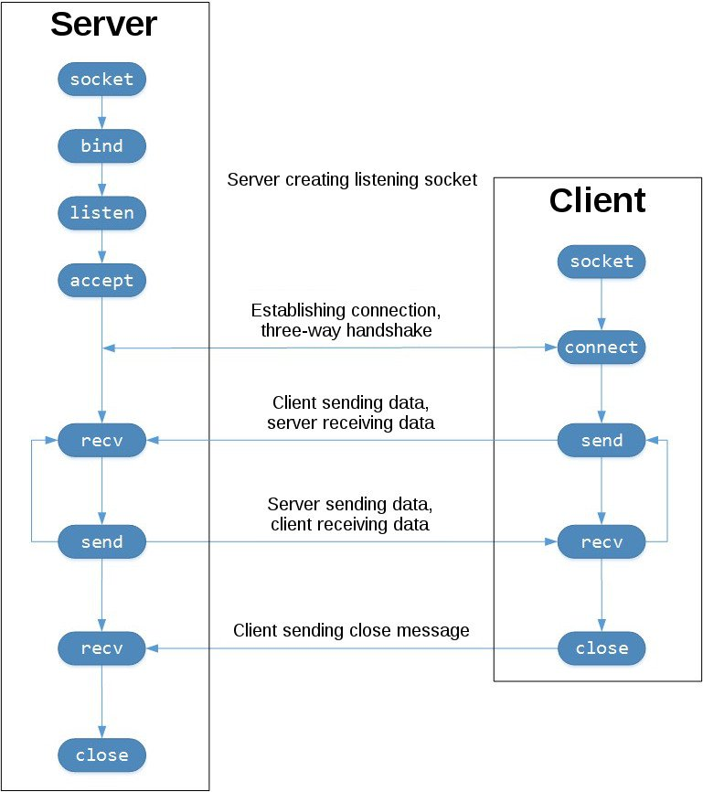

# Learn Socket

socket communicate two node with each other on network, socket send data and receive.
when the server script run, it will hang on then accept(), once the client script runs, the connection will be established to send and receive data

